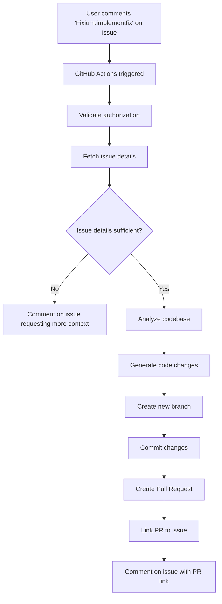

# Fixium:implementfix Feature - Implementation Plan

## Feature Overview

**Trigger**: `Fixium:implementfix` comment on GitHub issues  
**Purpose**: Automatically analyze issue, generate code fixes, and create a PR with implementation  
**Scope**: Same repository only (for security and simplicity)

## User Flow



## Architecture Components

### 1. Issue Analyzer (`fixium/issue_analyzer.py`)
**Purpose**: Parse and understand GitHub issue content

**Responsibilities**:
- Fetch issue details (title, body, labels, comments)
- Extract requirements and acceptance criteria
- Identify affected components/files
- Determine if issue has sufficient context
- Classify issue type (bug, feature, enhancement)

**Key Methods**:
```python
class IssueAnalyzer:
    def analyze_issue(issue_number: int) -> IssueAnalysis
    def has_sufficient_context(issue: Issue) -> tuple[bool, list[str]]
    def extract_requirements(issue: Issue) -> list[Requirement]
    def identify_affected_files(issue: Issue) -> list[str]
```

**Output Format**:
```json
{
  "issueNumber": 123,
  "title": "Fix authentication bug",
  "type": "bug|feature|enhancement",
  "hasSufficientContext": true,
  "missingContext": [],
  "requirements": [
    {
      "description": "Fix OAuth token refresh",
      "priority": "high",
      "acceptanceCriteria": ["Token refreshes automatically", "No user logout"]
    }
  ],
  "affectedComponents": ["src/auth/oauth.py", "src/middleware/auth.py"],
  "relatedIssues": [120, 115],
  "labels": ["bug", "authentication", "high-priority"]
}
```

### 2. Code Change Generator (`fixium/code_generator.py`)
**Purpose**: Generate code changes based on issue analysis

**Responsibilities**:
- Use Bob AI to understand current code
- Generate fixes/implementations
- Validate generated code (syntax, tests)
- Create file diffs
- Handle multiple file changes

**Key Methods**:
```python
class CodeGenerator:
    def generate_changes(issue_analysis: IssueAnalysis) -> CodeChanges
    def validate_changes(changes: CodeChanges) -> ValidationResult
    def create_diffs(changes: CodeChanges) -> list[FileDiff]
```

**Output Format**:
```json
{
  "issueNumber": 123,
  "changes": [
    {
      "file": "src/auth/oauth.py",
      "action": "modify|create|delete",
      "diff": "unified diff format",
      "description": "Add token refresh logic",
      "linesAdded": 25,
      "linesRemoved": 5
    }
  ],
  "testsAdded": ["tests/test_oauth_refresh.py"],
  "validationStatus": "passed|failed",
  "validationErrors": []
}
```

### 3. PR Creator (`fixium/pr_creator.py`)
**Purpose**: Create and manage pull requests

**Responsibilities**:
- Create new branch from main/master
- Apply code changes
- Commit with descriptive messages
- Create PR with detailed description
- Link PR to original issue
- Add labels and reviewers

**Key Methods**:
```python
class PRCreator:
    def create_branch(issue_number: int) -> str
    def apply_changes(branch: str, changes: CodeChanges) -> bool
    def create_pull_request(issue: Issue, changes: CodeChanges) -> PullRequest
    def link_to_issue(pr: PullRequest, issue_number: int) -> None
```

**PR Description Template**:
```markdown
## Fixes #{issue_number}

### Changes Made
- [List of changes]

### Implementation Details
[Detailed explanation of the implementation]

### Testing
- [x] Unit tests added/updated
- [x] Manual testing completed
- [ ] Integration tests (if applicable)

### Related Files
- `file1.py` - Description
- `file2.py` - Description

---
*🤖 Automatically generated by Fixium*
```

### 4. Issue Main Entry Point (`fixium/issue_main.py`)
**Purpose**: Orchestrate the entire workflow

**Responsibilities**:
- Parse command from issue comment
- Coordinate all components
- Handle errors gracefully
- Post status updates to issue
- Manage workflow state

**Workflow Steps**:
```python
def main():
    1. Parse comment and validate authorization
    2. Fetch and analyze issue
    3. Check if context is sufficient
       - If NO: Post comment requesting more info
       - If YES: Continue
    4. Generate code changes using Bob AI
    5. Validate generated changes
    6. Create branch and apply changes
    7. Create pull request
    8. Link PR to issue
    9. Post success comment with PR link
```

### 5. Prompt Templates

#### `prompts/analyze-issue.md`
**Purpose**: Guide Bob AI in understanding the issue

**Content**:
- Issue parsing methodology
- Context sufficiency criteria
- Requirement extraction guidelines
- Component identification rules

#### `prompts/generate-fix.md`
**Purpose**: Guide Bob AI in generating code fixes

**Content**:
- Code analysis methodology
- Fix generation guidelines
- Testing requirements
- Code quality standards
- Multi-file change handling

## GitHub Actions Workflow

### New Job: `fixium-implement`

```yaml
fixium-implement:
  # Trigger on issue comments (not PR comments)
  if: |
    !github.event.issue.pull_request &&
    contains(github.event.comment.body, 'Fixium:implementfix')
  
  runs-on: ubuntu-latest
  
  permissions:
    contents: write      # Create branches and commits
    pull-requests: write # Create PRs
    issues: write        # Comment on issues
  
  steps:
    - name: Checkout repository
      uses: actions/checkout@v4
      with:
        fetch-depth: 0
    
    - name: Set up Python
      uses: actions/setup-python@v5
      with:
        python-version: '3.11'
    
    - name: Install dependencies
      run: pip install -r requirements.txt
    
    - name: Install Bob CLI
      run: |
        # Install Bob CLI
        echo "Bob CLI installation"
    
    - name: Run Fixium Issue Implementation
      run: python -m fixium.issue_main
      env:
        GITHUB_TOKEN: ${{ secrets.GITHUB_TOKEN }}
        BOBSHELL_API_KEY: ${{ secrets.BOBSHELL_API_KEY }}
        ISSUE_NUMBER: ${{ github.event.issue.number }}
        COMMENT_USER: ${{ github.event.comment.user.login }}
```

## Data Flow

```
Issue Comment
    ↓
GitHub Actions (issue_comment event)
    ↓
issue_main.py
    ↓
IssueAnalyzer → analyze_issue()
    ↓
    ├─→ Insufficient context? → Comment on issue → END
    ↓
    └─→ Sufficient context
        ↓
CodeGenerator → generate_changes()
    ↓
    ├─→ Bob AI analyzes codebase
    ├─→ Bob AI generates fixes
    └─→ Validates changes
        ↓
PRCreator → create_pull_request()
    ↓
    ├─→ Create branch (fixium/issue-{number})
    ├─→ Apply changes
    ├─→ Commit changes
    ├─→ Push branch
    ├─→ Create PR
    └─→ Link to issue
        ↓
Comment on issue with PR link
```

## File Structure

```
fixium/
├── issue_analyzer.py      # NEW: Analyze GitHub issues
├── code_generator.py      # NEW: Generate code changes
├── pr_creator.py          # NEW: Create pull requests
├── issue_main.py          # NEW: Main entry point for implementfix
├── comment_parser.py      # UPDATE: Add implementfix command
└── github_client.py       # UPDATE: Add issue and branch methods

prompts/
├── analyze-issue.md       # NEW: Issue analysis prompt
└── generate-fix.md        # NEW: Code generation prompt

.github/workflows/
└── fixium.yml            # UPDATE: Add fixium-implement job

tests/
├── test_issue_analyzer.py # NEW: Tests for issue analyzer
├── test_code_generator.py # NEW: Tests for code generator
└── test_pr_creator.py     # NEW: Tests for PR creator
```

## Implementation Phases

### Phase 1: Core Components (Week 1)
- [ ] Create `issue_analyzer.py` with issue parsing logic
- [ ] Create `code_generator.py` with Bob AI integration
- [ ] Create `pr_creator.py` with GitHub API integration
- [ ] Update `github_client.py` with issue/branch methods
- [ ] Update `comment_parser.py` for implementfix command

### Phase 2: Prompt Engineering (Week 1)
- [ ] Create `prompts/analyze-issue.md`
- [ ] Create `prompts/generate-fix.md`
- [ ] Test prompts with various issue types
- [ ] Refine prompts based on results

### Phase 3: Workflow Integration (Week 2)
- [ ] Create `issue_main.py` orchestrator
- [ ] Update `.github/workflows/fixium.yml`
- [ ] Add error handling and status updates
- [ ] Test end-to-end workflow

### Phase 4: Testing & Validation (Week 2)
- [ ] Create comprehensive test suite
- [ ] Test with real issues (bug fixes, features)
- [ ] Validate generated code quality
- [ ] Test edge cases (insufficient context, complex changes)

### Phase 5: Documentation (Week 3)
- [ ] Update README.md with usage examples
- [ ] Update agents.md with technical details
- [ ] Create user guide for implementfix
- [ ] Document limitations and best practices

## Security Considerations

1. **Authorization**: Only authorized users can trigger implementfix
2. **Branch Protection**: Create branches with `fixium/` prefix
3. **Code Review**: All generated PRs require human review
4. **Validation**: Generated code must pass syntax checks
5. **Rate Limiting**: Limit number of concurrent implementations
6. **Scope**: Only same repository (no cross-repo changes)

## Error Handling

### Insufficient Context
```markdown
⚠️ **Insufficient Context**

I need more information to implement this fix. Please update the issue description with:

- [ ] Detailed steps to reproduce (for bugs)
- [ ] Expected behavior vs actual behavior
- [ ] Affected files or components (if known)
- [ ] Acceptance criteria for the fix

Once you've added this information, comment `Fixium:implementfix` again.
```

### Generation Failed
```markdown
❌ **Implementation Failed**

I encountered an error while generating the fix:
[Error details]

This could be due to:
- Complex changes requiring human judgment
- Insufficient codebase context
- Ambiguous requirements

Please consider implementing this manually or breaking it into smaller issues.
```

### Validation Failed
```markdown
⚠️ **Code Validation Failed**

Generated code has the following issues:
- [List of validation errors]

I'll create a draft PR for you to review and fix these issues manually.
```

## Success Metrics

- **Context Sufficiency Rate**: % of issues with sufficient context
- **Generation Success Rate**: % of successful code generations
- **PR Acceptance Rate**: % of generated PRs that get merged
- **Time to PR**: Average time from comment to PR creation
- **Code Quality**: Linter/test pass rate for generated code

## Limitations & Future Enhancements

### Current Limitations
- Same repository only
- Single issue per implementation
- No multi-step implementations
- Limited to text-based code (no binary files)
- Requires clear issue descriptions

### Future Enhancements
- Multi-issue implementations
- Cross-repository changes
- Interactive clarification (back-and-forth)
- Learning from past implementations
- Integration with CI/CD for auto-merge
- Support for complex refactorings

## Example Usage

### Bug Fix Example
```markdown
**Issue #123: OAuth token refresh fails**

Description: Users are getting logged out when their OAuth token expires.

Steps to reproduce:
1. Login with OAuth
2. Wait for token to expire (1 hour)
3. Try to make an API call
4. User gets logged out instead of token refreshing

Expected: Token should refresh automatically
Actual: User gets logged out

Affected files: src/auth/oauth.py, src/middleware/auth.py
```

**Comment**: `Fixium:implementfix`

**Result**: PR created with token refresh logic

### Feature Example
```markdown
**Issue #456: Add dark mode support**

Description: Add dark mode toggle to user settings

Requirements:
- Toggle in user settings page
- Persist preference in database
- Apply theme across all pages
- Default to system preference

Acceptance Criteria:
- [ ] Toggle visible in settings
- [ ] Theme persists across sessions
- [ ] All pages respect theme
- [ ] Tests added
```

**Comment**: `Fixium:implementfix`

**Result**: PR created with dark mode implementation

## Questions for Clarification

1. **Branch Naming**: Use `fixium/issue-{number}` or `fix/issue-{number}`?
2. **PR Auto-merge**: Should we support auto-merge for simple fixes?
3. **Test Generation**: Should we generate tests automatically?
4. **Review Assignment**: Auto-assign reviewers based on CODEOWNERS?
5. **Draft PRs**: Create as draft for validation failures?

---

**Status**: Planning Phase  
**Last Updated**: 2026-05-11  
**Next Steps**: Review plan and begin Phase 1 implementation